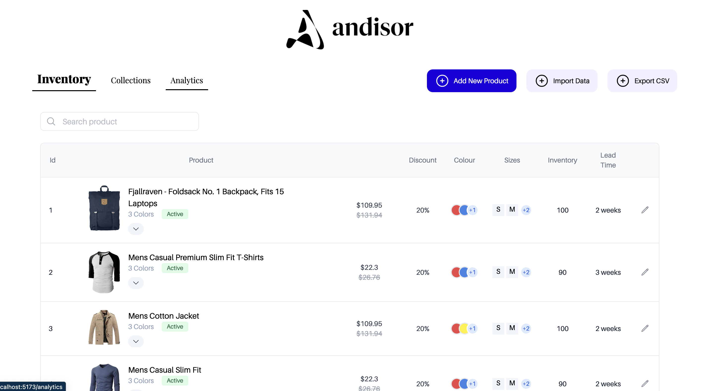

<a name="readme-top"></a>

<!-- PROJECT LOGO -->
<br />
<div align="center">
  <a href="https://andisor.com">
    
  </a>
  <h3 align="center">Inventory: React Project</h3>
</div>

<!-- ABOUT THE PROJECT -->
## About The Project
<div align="center">
    
</div>

The project is made using React + Vite with JavaScript.
The dashboard page navigates across 3 routes using `react-router-dom`
* `/inventory` - Default Route
* `/collections` 
* `/analytics`

Feature Implemented:
* The data for inventory table is fetched from the json present at : https://mocki.io/v1/bba42ac4-c683-45f1-9316-babbb7fe53e9 using `axios`
* Each row in the table is expandable to the primary variants and further to secondary variants of the product.
* A brief summary of the colors and size available are evaluated in the main product row itself.
* The search bar can be used to find the product matching to the string passed.
* Each row supports inline editing for the fields of the row. To edit: 
  * Click the far right edit button.
  * Edit the corresponding fields and click on the same save button.
* The edited changes for each row are stored in the sessionStorage and re-rendered from there when the page loads.

To setup :
```
    npm install
    npm run dev
```

<p align="right">(<a href="#readme-top">back to top</a>)</p>

<!-- ROADMAP -->
## Roadmap

- [x] Breakdown UI into components 
- [x] Add Routing
- [x] Add Table Component
- [x] Fetch Data from API / Json
- [x] Populate the Rows and Sub-Rows.
- [x] Add search bar
- [x] Add expand row functionality
- [x] Add edit button for each row.
- [x] Store edited data in sessionStorage

<!-- CONTACT -->
## Contact

Abhishek Sheoran - [@abhisheksheoran](https://www.linkedin.com/in/abhishek-sheoran-248189175/) - abhisheksheoranofficial@gmail.com
 